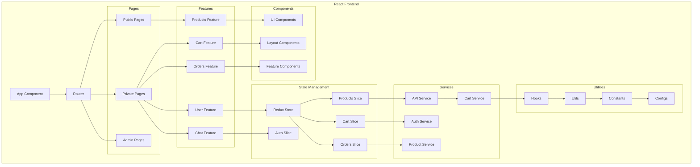
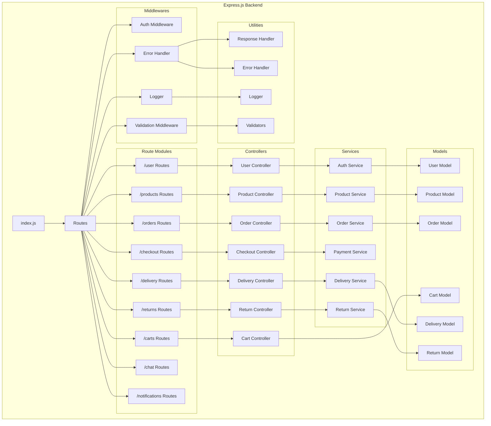
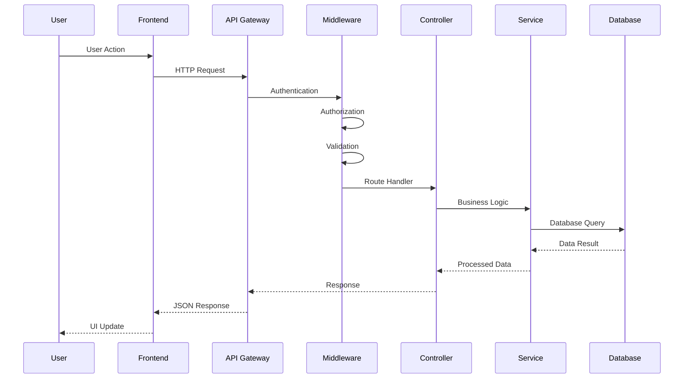

# Application Architecture Diagram

Detailed application architecture showing frontend and backend structure.

## Frontend Architecture

```mermaid
graph TB
    subgraph "React Frontend"
        A[App Component]
        B[Router]
        
        subgraph "Pages"
            C[Public Pages]
            D[Private Pages]
            E[Admin Pages]
        end
        
        subgraph "Features"
            F[Products Feature]
            G[Cart Feature]
            H[Orders Feature]
            I[User Feature]
            J[Chat Feature]
        end
        
        subgraph "Components"
            K[UI Components]
            L[Layout Components]
            M[Feature Components]
        end
        
        subgraph "State Management"
            N[Redux Store]
            O[Auth Slice]
            P[Products Slice]
            Q[Cart Slice]
            R[Orders Slice]
        end
        
        subgraph "Services"
            S[API Service]
            T[Auth Service]
            U[Product Service]
            V[Cart Service]
        end
        
        subgraph "Utilities"
            W[Hooks]
            X[Utils]
            Y[Constants]
            Z[Configs]
        end
    end
    
    A --> B
    B --> C
    B --> D
    B --> E
    C --> F
    D --> G
    D --> H
    D --> I
    D --> J
    F --> K
    G --> L
    H --> M
    I --> N
    J --> O
    N --> P
    N --> Q
    N --> R
    P --> S
    Q --> T
    R --> U
    S --> V
    V --> W
    W --> X
    X --> Y
    Y --> Z
```

## Backend Architecture

```mermaid
graph TB
    subgraph "Express.js Backend"
        A[index.js]
        B[Routes]
        
        subgraph "Route Modules"
            C["/user Routes"]
            D["/products Routes"]
            E["/carts Routes"]
            F["/orders Routes"]
            G["/delivery Routes"]
            H["/returns Routes"]
            I["/checkout Routes"]
            J["/chat Routes"]
            K["/notifications Routes"]
        end
        
        subgraph "Controllers"
            L[User Controller]
            M[Product Controller]
            N[Cart Controller]
            O[Order Controller]
            P[Delivery Controller]
            Q[Return Controller]
            R[Checkout Controller]
        end
        
        subgraph "Services"
            S[Auth Service]
            T[Product Service]
            U[Order Service]
            V[Payment Service]
            W[Delivery Service]
            X[Return Service]
        end
        
        subgraph "Models"
            Y[User Model]
            Z[Product Model]
            AA[Order Model]
            AB[Cart Model]
            AC[Delivery Model]
            AD[Return Model]
        end
        
        subgraph "Middlewares"
            AE[Auth Middleware]
            AF[Validation Middleware]
            AG[Error Handler]
            AH[Logger]
        end
        
        subgraph "Utilities"
            AI[Response Handler]
            AJ[Error Handler]
            AK[Logger]
            AL[Validators]
        end
    end
    
    A --> B
    B --> C
    B --> D
    B --> E
    B --> F
    B --> G
    B --> H
    B --> I
    B --> J
    B --> K
    C --> L
    D --> M
    E --> N
    F --> O
    G --> P
    H --> Q
    I --> R
    L --> S
    M --> T
    O --> U
    R --> V
    P --> W
    Q --> X
    S --> Y
    T --> Z
    U --> AA
    N --> AB
    W --> AC
    X --> AD
    B --> AE
    B --> AF
    B --> AG
    B --> AH
    AG --> AI
    AG --> AJ
    AH --> AK
    AF --> AL
```

## Data Flow

```mermaid
sequenceDiagram
    participant U as User
    participant F as Frontend
    participant API as API Gateway
    participant M as Middleware
    participant C as Controller
    participant S as Service
    participant DB as Database
    
    U->>F: User Action
    F->>API: HTTP Request
    API->>M: Authentication
    M->>M: Authorization
    M->>M: Validation
    M->>C: Route Handler
    C->>S: Business Logic
    S->>DB: Database Query
    DB-->>S: Data Result
    S-->>C: Processed Data
    C-->>API: Response
    API-->>F: JSON Response
    F-->>U: UI Update
```
