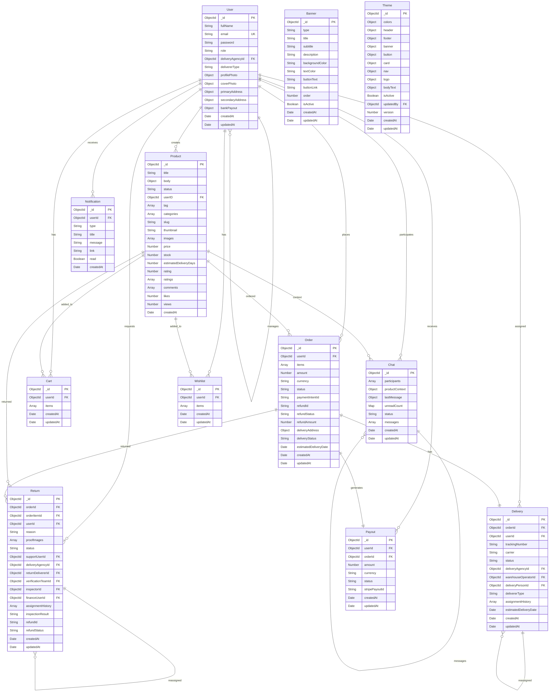

# Database Schema Diagram

Entity Relationship Diagram (ERD) showing all database collections and their relationships.

## Database Schema

## Collection Relationships

### User Relationships
- **One-to-Many**: User can create multiple Products
- **One-to-Many**: User can place multiple Orders
- **One-to-One**: User has one Cart
- **One-to-Many**: User can have multiple Deliveries assigned
- **One-to-Many**: User can request multiple Returns
- **One-to-Many**: User can participate in multiple Chats
- **One-to-Many**: User receives multiple Notifications
- **One-to-One**: User has one Wishlist
- **One-to-Many**: User can receive multiple Payouts
- **Many-to-One**: Delivery Person belongs to Delivery Agency

### Product Relationships
- **One-to-Many**: Product can be in multiple Carts
- **One-to-Many**: Product can be in multiple Orders
- **One-to-Many**: Product can be returned multiple times
- **One-to-Many**: Product can be in multiple Wishlists
- **One-to-One**: Product can be context for Chat

### Order Relationships
- **One-to-One**: Order has one Delivery
- **One-to-Many**: Order can have multiple Returns
- **One-to-One**: Order generates one Payout

### Delivery Relationships
- **One-to-Many**: Delivery can have multiple reassignments (history)
- **Many-to-One**: Delivery belongs to one Order

### Return Relationships
- **One-to-Many**: Return can have multiple reassignments (history)
- **Many-to-One**: Return belongs to one Order

### Chat Relationships
- **One-to-Many**: Chat has multiple Messages
- **Many-to-Many**: Chat has multiple Participants (Users)

## Indexes

### User Collection
- `email`: Unique index
- `role`: Index for role-based queries
- `deliveryAgencyId`: Index for agency relationships

### Product Collection
- `userID`: Index for seller products
- `categories`: Index for category filtering
- `tag`: Index for tag filtering
- `slug`: Index for product lookup

### Order Collection
- `userId`: Index for user orders
- `status`: Index for status filtering
- `paymentIntentId`: Index for payment lookup

### Delivery Collection
- `orderId`: Index for order lookup
- `userId`: Index for assigned user
- `status`: Index for status filtering

### Chat Collection
- `participants.userId`: Index for user chats
- `status`: Index for status filtering

### Notification Collection
- `userId`: Index for user notifications
- `read`: Index for unread notifications
