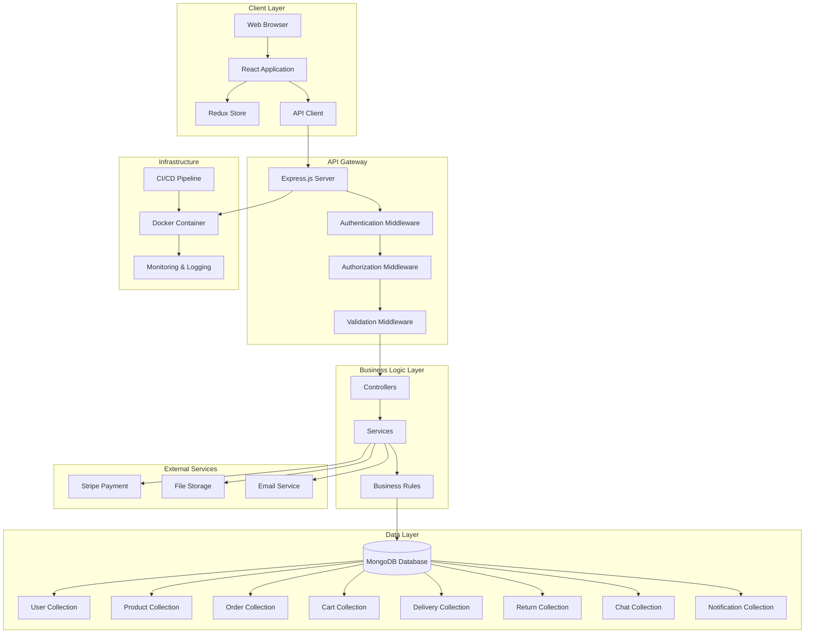

# System Architecture Diagram

High-level system architecture overview of the Enterprise E-Commerce Platform.

## System Architecture

## Component Descriptions

### Client Layer
- **Web Browser**: User interface
- **React Application**: Frontend framework
- **Redux Store**: State management
- **API Client**: HTTP client for backend communication

### API Gateway
- **Express.js Server**: Node.js web server
- **Authentication Middleware**: JWT token validation
- **Authorization Middleware**: Role-based access control
- **Validation Middleware**: Input validation

### Business Logic Layer
- **Controllers**: Request handlers
- **Services**: Business logic implementation
- **Business Rules**: Domain-specific rules

### Data Layer
- **MongoDB Database**: NoSQL database
- **Collections**: User, Product, Order, Cart, Delivery, Return, Chat, Notification

### External Services
- **Stripe Payment**: Payment processing
- **File Storage**: Image and file storage
- **Email Service**: Email notifications

### Infrastructure
- **Docker Container**: Containerization
- **CI/CD Pipeline**: Automated deployment
- **Monitoring & Logging**: System monitoring
