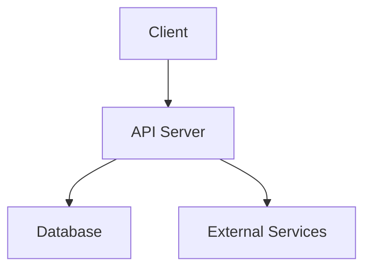
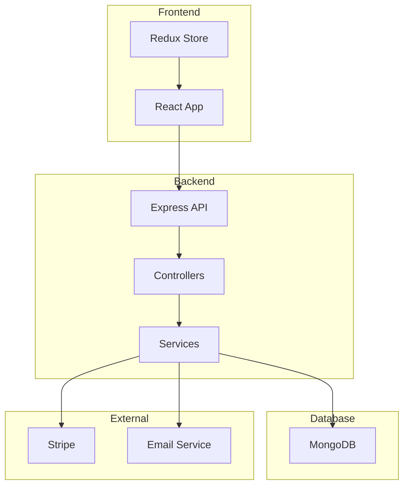
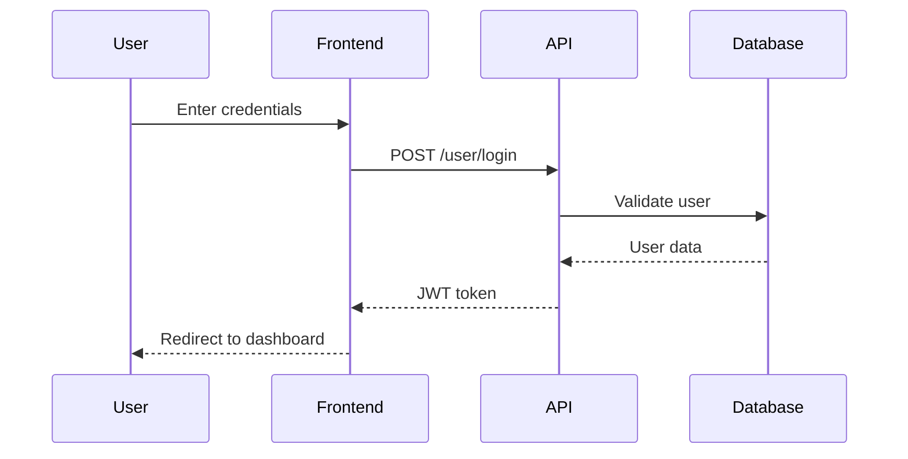
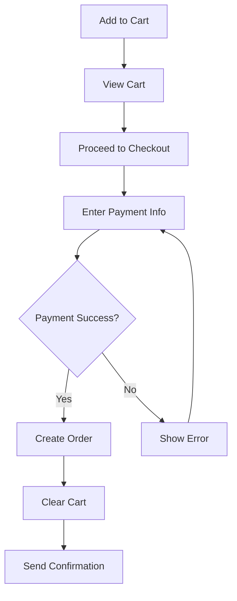

# System Diagrams Documentation

Documentation for creating and maintaining system diagrams for the Enterprise E-Commerce Platform.

## 📚 Documentation

This section contains information about system diagrams, architecture diagrams, and flowcharts used in the project.

## 🎨 Diagram Tools

### Recommended Tools

- **[Mermaid.js](https://mermaid.js.org/)** - Markdown-based diagramming (Recommended)
- **PlantUML** - Text-based UML diagrams
- **Draw.io** - Visual diagram editor
- **Lucidchart** - Cloud-based diagramming

### Mermaid.js Integration

Mermaid diagrams can be embedded directly in Markdown files:



## 📊 Diagram Types

### 1. Architecture Diagrams

#### System Architecture
- High-level system overview
- Component relationships
- Data flow
- Technology stack

#### Application Architecture
- Frontend architecture
- Backend architecture
- Database schema
- API structure

### 2. Flow Diagrams

#### User Flows
- User registration flow
- Order placement flow
- Payment processing flow
- Return/refund flow

#### Process Flows
- Development workflow
- Deployment process
- Testing process
- Code review process

### 3. Sequence Diagrams

#### API Interactions
- Request/response flows
- Authentication flows
- Payment processing
- Order lifecycle

### 4. Entity Relationship Diagrams

#### Database Schema
- Collection relationships
- Data models
- Indexes
- Constraints

## 📝 Generated Diagrams

The following diagrams have been generated for the application:

### Architecture Diagrams
- **[System Architecture](./architecture/system-architecture.md)** - High-level system overview
- **[Application Architecture](./architecture/application-architecture.md)** - Detailed frontend and backend architecture
- **[Database Schema](./architecture/database-schema.md)** - Complete database ERD with all collections

### Flow Diagrams
- **[User Flows](./flows/user-flows.md)** - User registration, order placement, payment, return/refund flows
- **[Process Flows](./flows/process-flows.md)** - Development, deployment, CI/CD, and error handling flows
- **[API Flows](./flows/api-flows.md)** - API request/response patterns and flows

### Sequence Diagrams
- **[Authentication Sequences](./sequences/authentication-sequence.md)** - Login, registration, token validation sequences
- **[Order Sequences](./sequences/order-sequence.md)** - Order creation, payment, delivery, return processing sequences

## 📝 Creating Diagrams

### Using Mermaid.js

1. **Create diagram file** (`.md` or `.mermaid`)
2. **Write diagram code**:
   ```mermaid
   graph LR
       A[User] --> B[Login]
       B --> C{Dashboard}
       C --> D[Products]
       C --> E[Orders]
   ```
3. **Render in Markdown** - Most Markdown renderers support Mermaid

### Diagram Best Practices

- **Clear labels** - Use descriptive names
- **Consistent style** - Follow project conventions
- **Keep it simple** - Don't overcrowd diagrams
- **Update regularly** - Keep diagrams current
- **Version control** - Track diagram changes

## 🗂️ Diagram Organization

### Recommended Structure

```
docs/diagrams/
├── architecture/
│   ├── system-architecture.md
│   ├── application-architecture.md
│   └── database-schema.md
├── flows/
│   ├── user-flows.md
│   ├── process-flows.md
│   └── api-flows.md
└── sequences/
    ├── authentication-sequence.md
    └── order-sequence.md
```

## 📋 Example Diagrams

### System Architecture



### User Authentication Flow



### Order Processing Flow



## 🔗 Related Documentation

- [Architecture Documentation](../architecture/architecture-index.md) - System architecture
- [API Documentation](../API/API-index.md) - API flows
- [Workflow Documentation](../workflow/changelog-index.md) - Process flows
- [Development Guide](../development/development-index.md) - Development flows

## 📖 Diagram Resources

### Mermaid.js Documentation

- [Mermaid.js Guide](https://mermaid.js.org/intro/)
- [Syntax Reference](https://mermaid.js.org/intro/syntax-reference.html)
- [Examples](https://mermaid.js.org/intro/examples.html)

### Diagram Types

- **Flowchart**: `graph TD` or `flowchart TD`
- **Sequence Diagram**: `sequenceDiagram`
- **Class Diagram**: `classDiagram`
- **State Diagram**: `stateDiagram-v2`
- **Entity Relationship**: `erDiagram`

## 🎯 Best Practices

### Creating Effective Diagrams

1. **Start with purpose** - Define what the diagram should show
2. **Use standard notation** - Follow common diagramming conventions
3. **Keep it focused** - One diagram, one purpose
4. **Add context** - Include descriptions and legends
5. **Review regularly** - Update diagrams with code changes

### Maintaining Diagrams

- Update diagrams when architecture changes
- Remove obsolete diagrams
- Organize diagrams logically
- Document diagram conventions
- Include in code reviews

## 🚀 Getting Started

1. **Choose a tool** - Start with Mermaid.js for Markdown integration
2. **Create diagram** - Use examples above as templates
3. **Add to docs** - Place in appropriate folder
4. **Link from README** - Reference from relevant documentation
5. **Update regularly** - Keep diagrams synchronized with code
