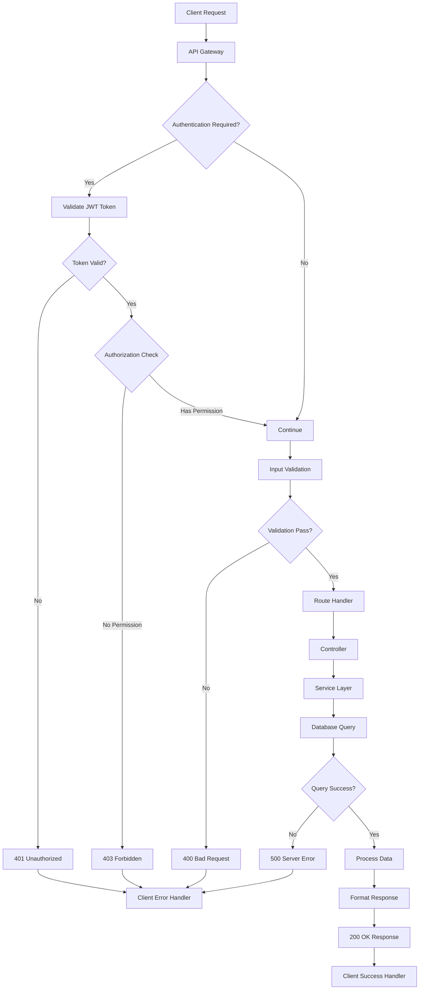
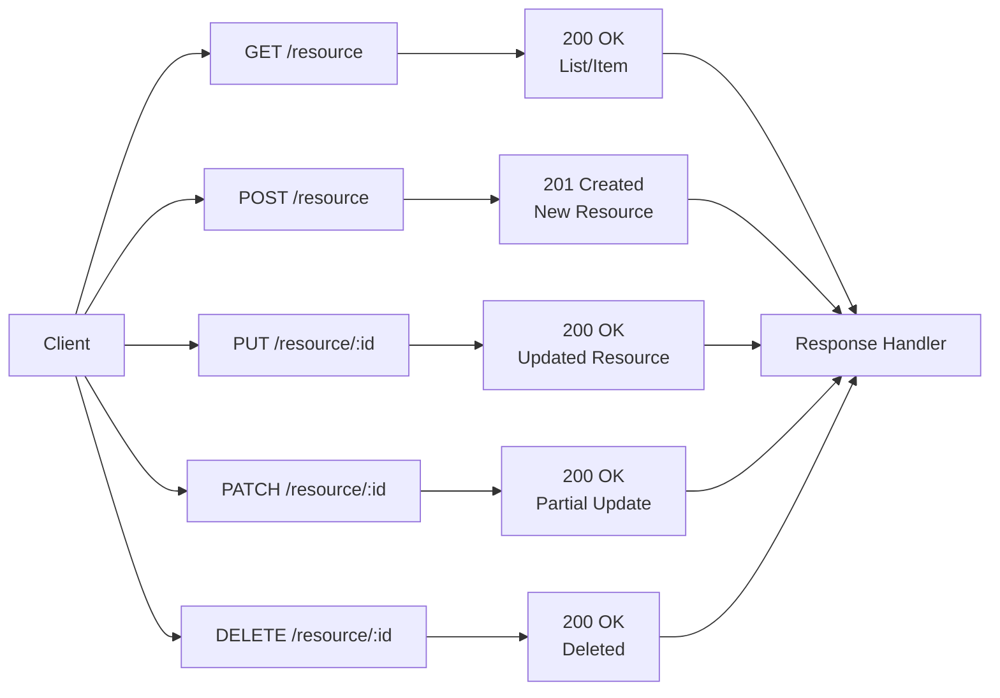
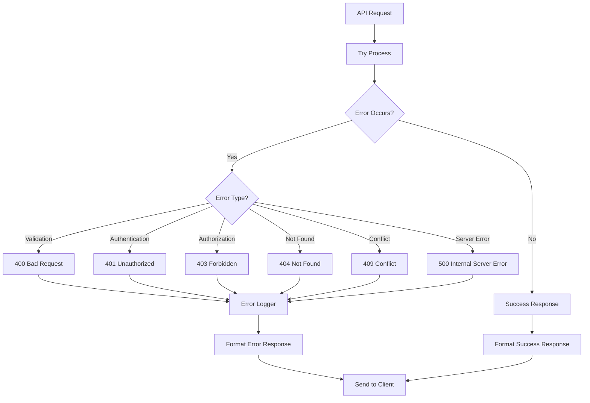
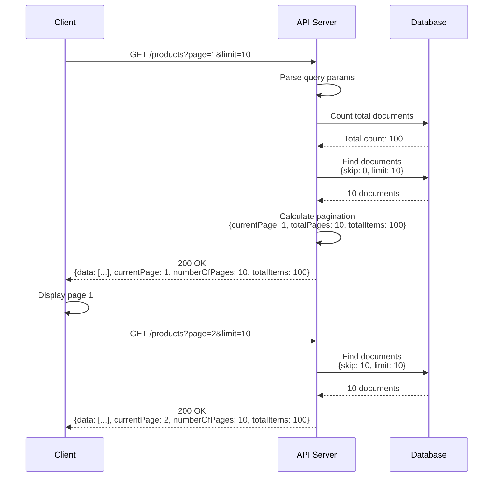
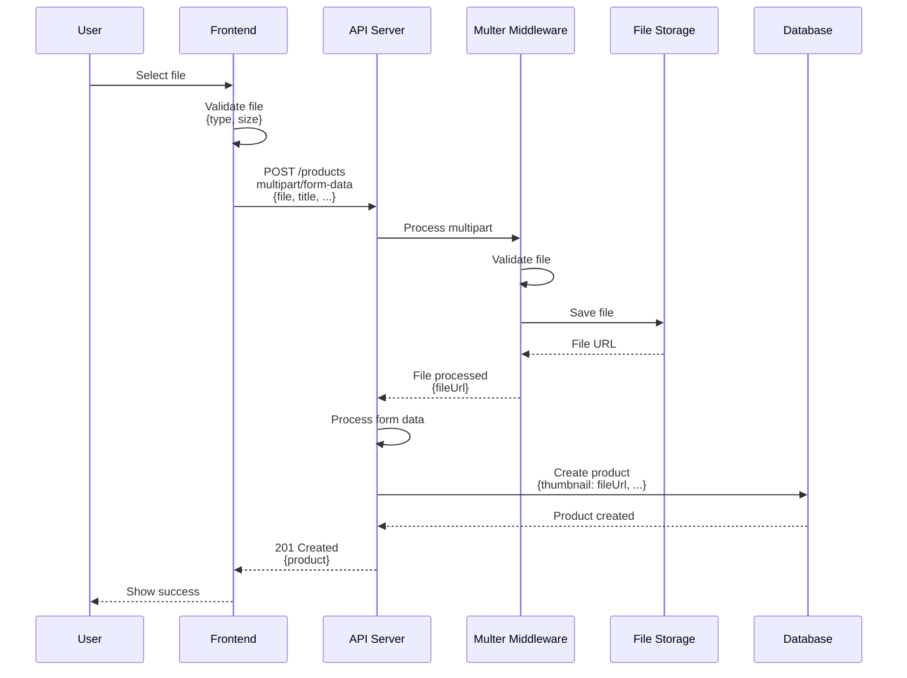
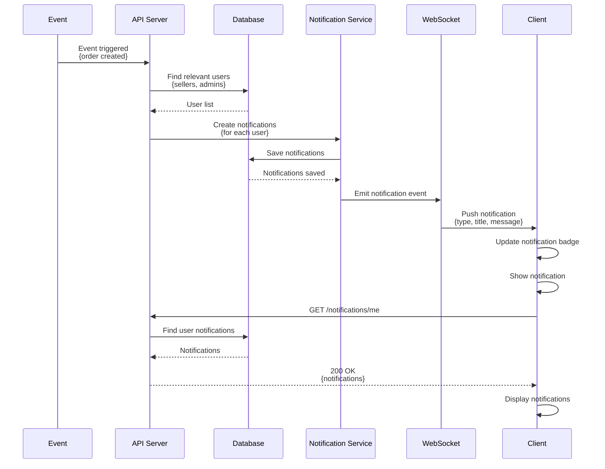

# API Flow Diagrams

API flow diagrams showing request/response patterns and API interactions.

## API Request Flow

## RESTful API Patterns

## Error Handling Flow

## Pagination Flow

## File Upload Flow

## Real-time Notification Flow

