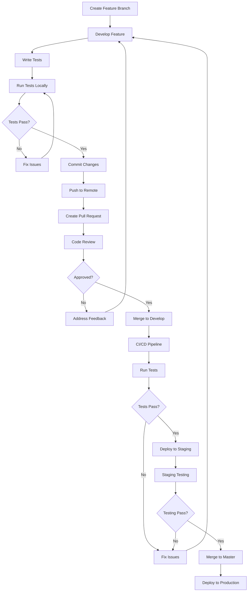
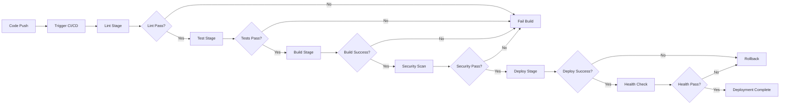
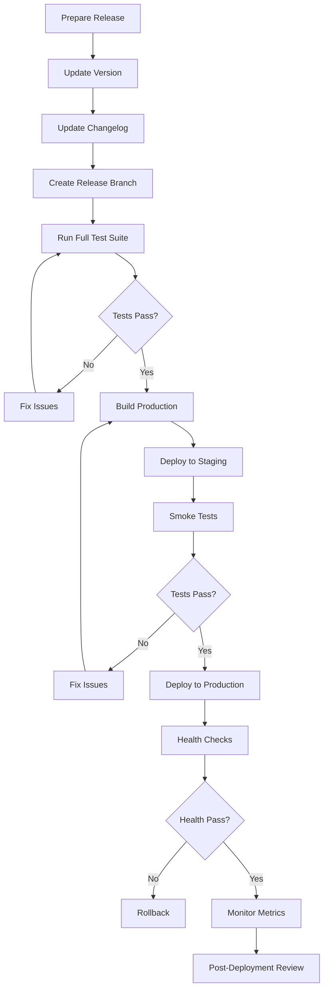
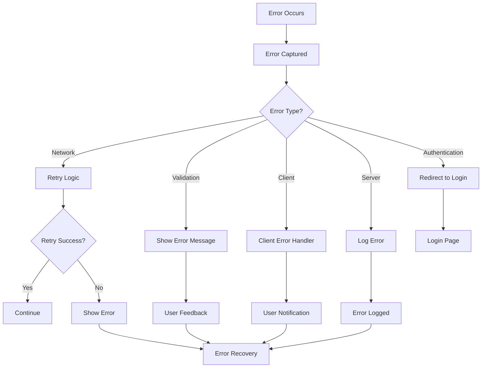
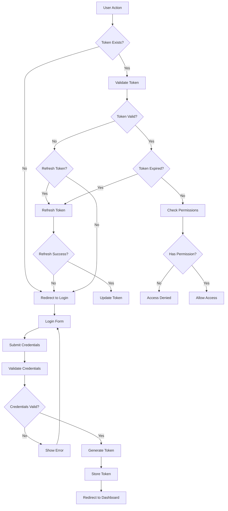

# Process Flow Diagrams

Process flow diagrams showing development, deployment, and operational workflows.

## Development Workflow

## CI/CD Pipeline Flow

## Deployment Process Flow

## Error Handling Flow

## Authentication Flow

