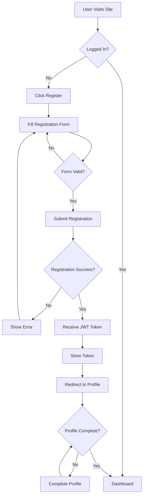
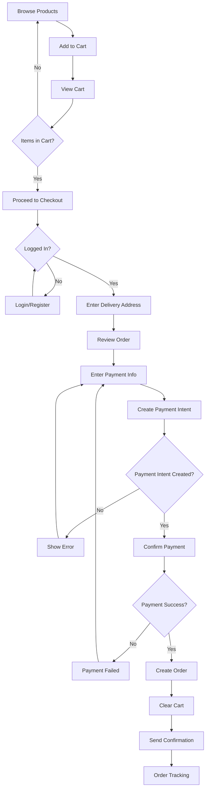
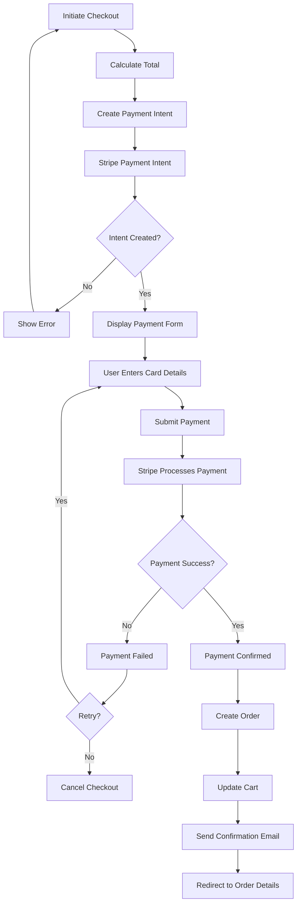
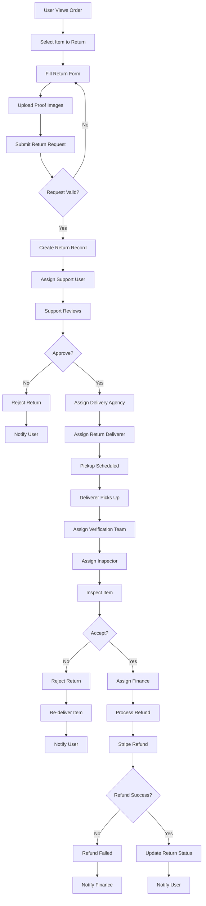
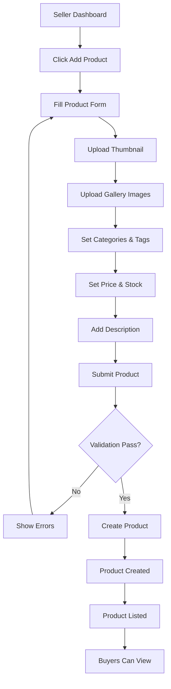
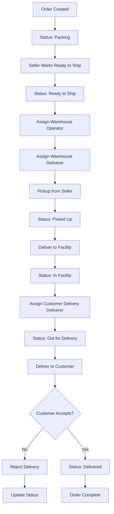

# User Flow Diagrams

User flow diagrams showing key user journeys in the application.

## User Registration Flow

## Order Placement Flow

## Payment Processing Flow

## Return/Refund Flow

## Product Management Flow (Seller)

## Delivery Tracking Flow

