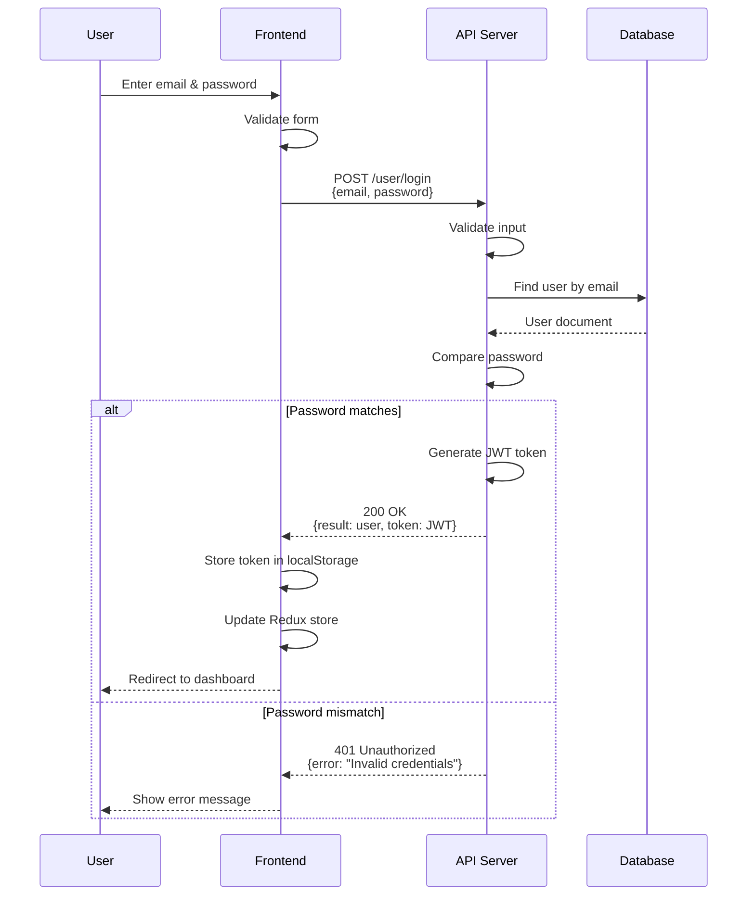
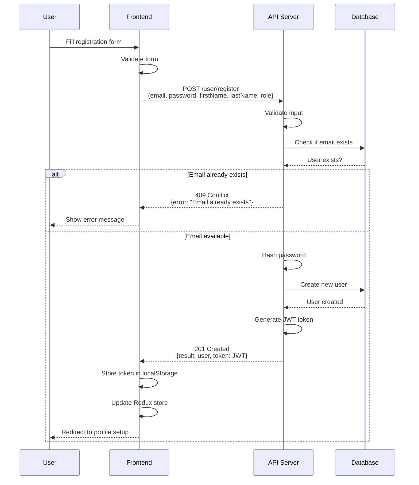
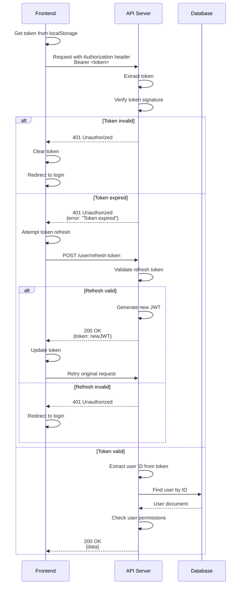
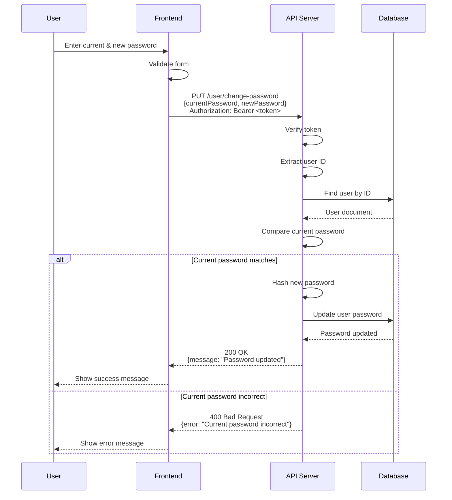

# Authentication Sequence Diagram

Sequence diagram showing the authentication flow between user, frontend, backend, and database.

## User Login Sequence

## User Registration Sequence

## Token Validation Sequence

## Password Change Sequence

