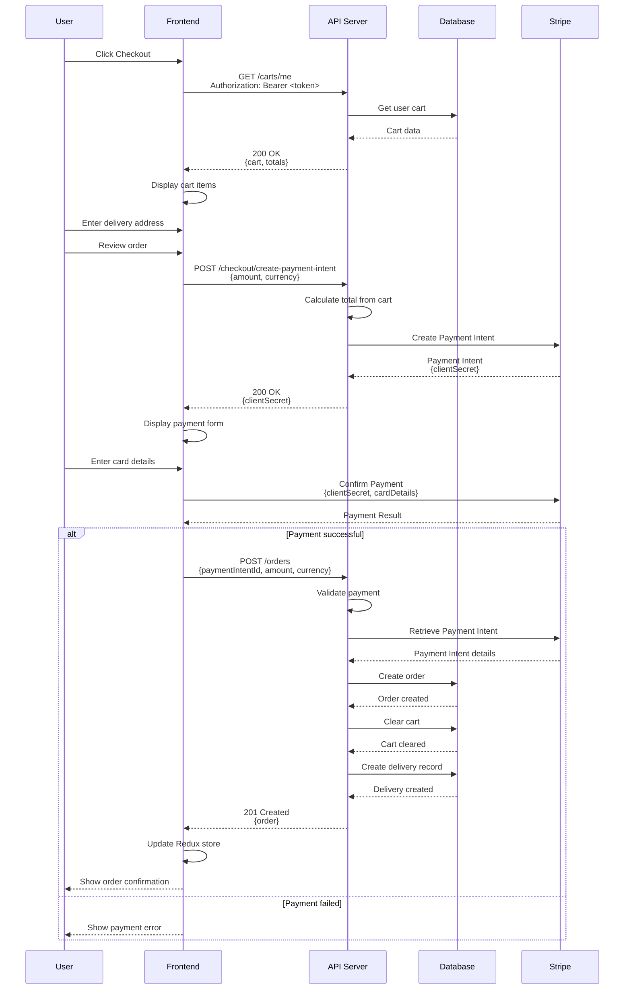
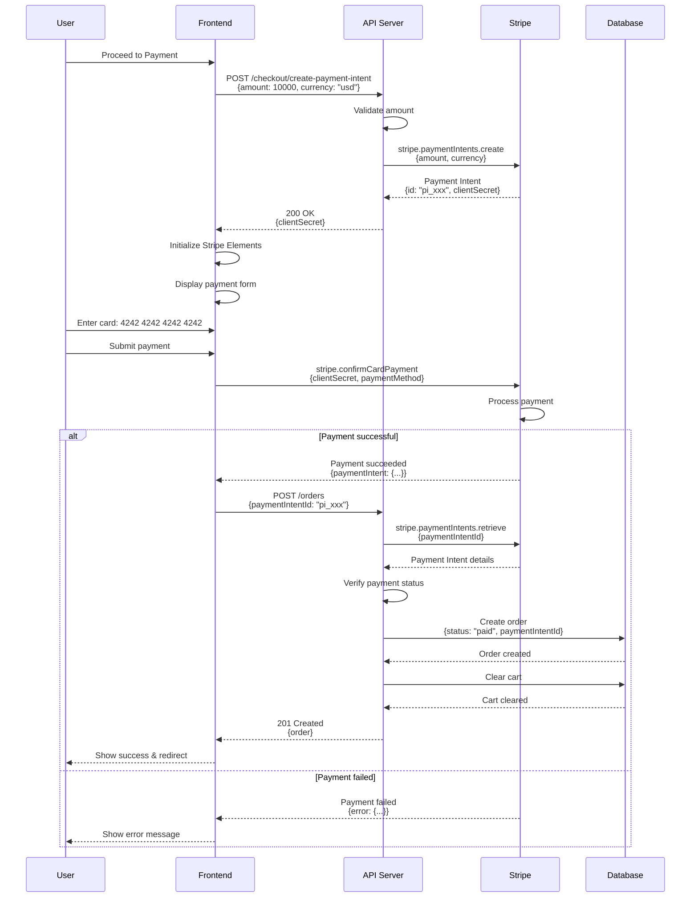
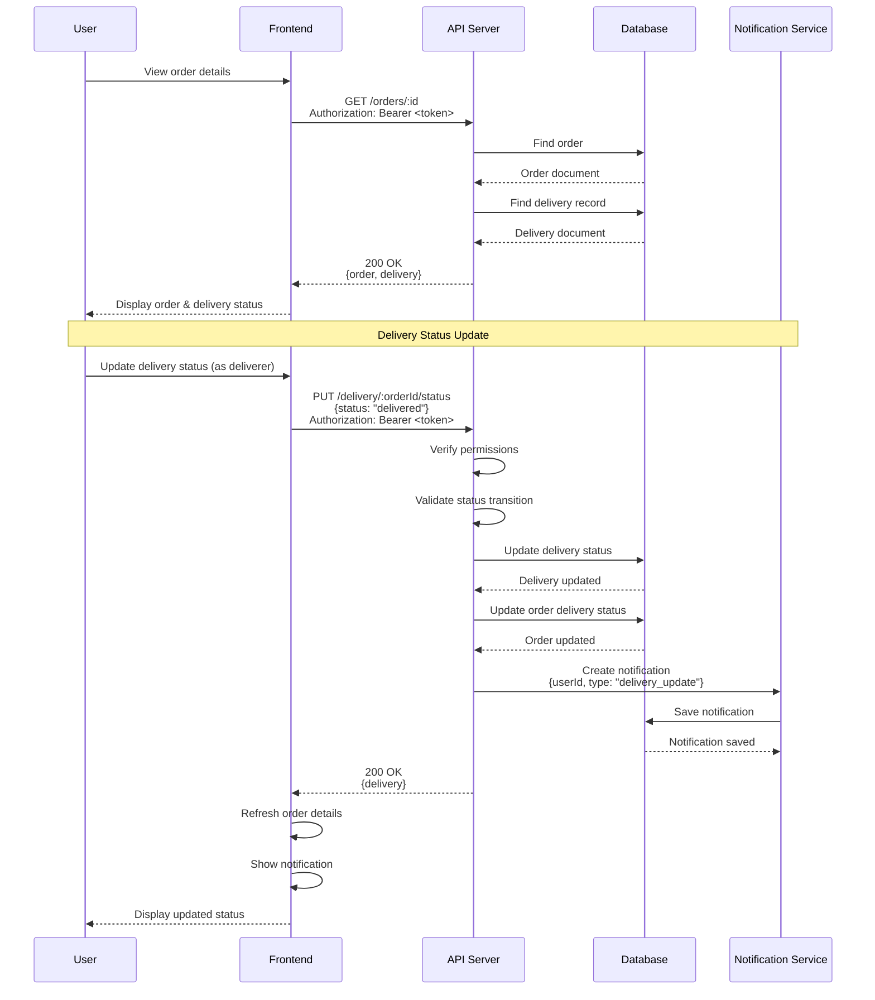
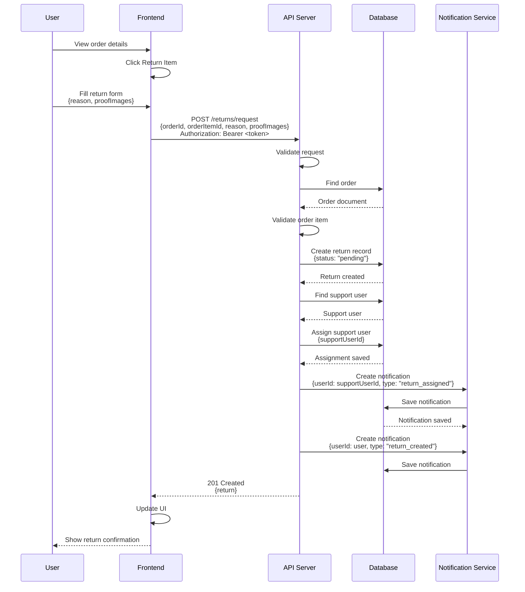
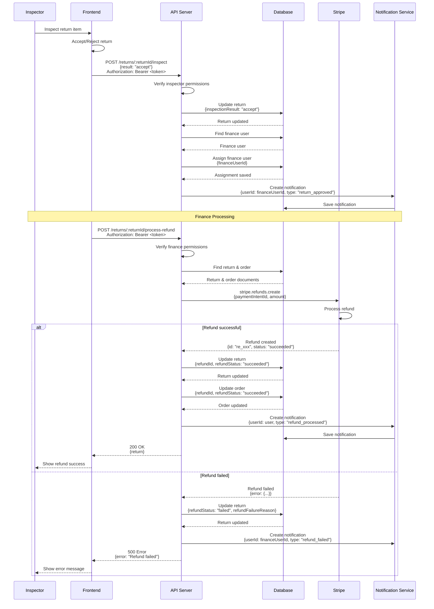

# Order Processing Sequence Diagram

Sequence diagrams showing order creation, payment processing, and delivery tracking.

## Order Creation Sequence

## Payment Processing Sequence

## Delivery Status Update Sequence

## Return Request Sequence

## Refund Processing Sequence

